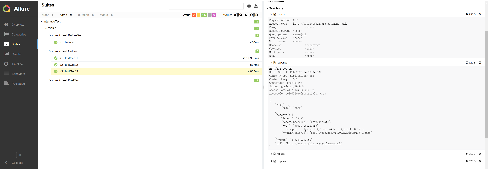

# 概要
java语言，rest-assured+testng+allure搭建接口自动化框架

# 结果

# 执行
执行文件为resources/testng/testng.xml。
在当前目录下会生成allure-results目录。
先[下载allure](https://github.com/allure-framework/allure2/releases),然后在项目目录下执行allure serve allure-results。
最后会使用默认浏览器打开allure报告，样例见上面的结果。
